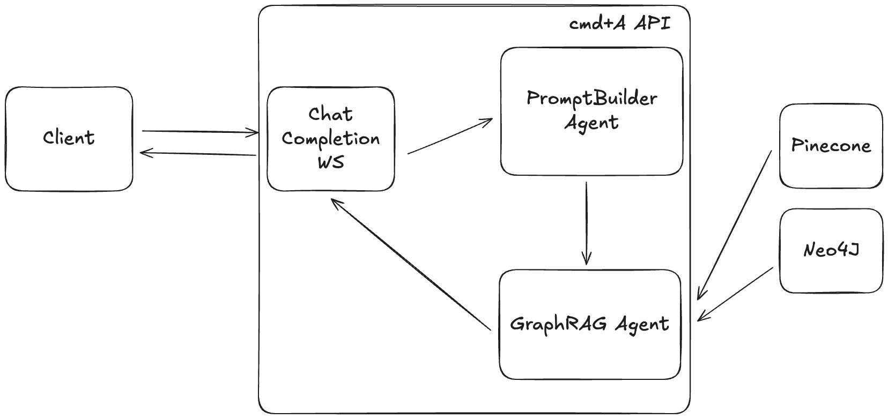

# cmd+A: Chat with your internal tools

**WARNING: the demo website https://cmda.mihir-trivedi.com is NOT intended for production use. BYOC production deployment instructions are located in `manifests/`.**

## Introduction
cmd+A enables users "chat" with their internal stores of knowledge via GraphRAG. Users simplify specify their source connections, and cmd+A automatically:
- Sets up workers to periodically parse content from the source (including OCR for file attachments)
- Sets up a knowledge graph to store similar documents together (e.g., `file X -- lives in --> Slack message Y`, `Slack message Y -- reply to --> Slack message Z`, and so forth).
- Performs entity resolution to link different sources together (e.g., `Slack message Z -- mentions --> Github PR A`).

Additional cmd+A features include:
- Semantic search + graph traversal in response to a user's query.
- Multiple chat model providers (OpenAI, Anthropic, Gemini, Groq, Mistral)
- Source attribution

The following sources are supported:
- Slack
- Github
- Notion

## Demo
[[ TODO ]]

## Tech Stack

- Backend: FastAPI (HTTP + Websockets), SQLModel, Alembic, PydanticAI, MongoDb, Redis, Pinecone, Neo4J
- Frontend: Vite, React + Typescript, nginx

## Architecture

cmd+A is deployed on a Kubernetes cluster. Tenant resources are separated via namespaces.

### Sources

The following diagram shows how cmd+A processes information from sources (using GitHub as an example.)

- Each source is associated with two resources: a scheduler (CRON job) and some workers (deployment).
- Data for each source is logically separated into "parent groups" (e.g., Slack _channels_, Github _repositories_, Notion _pages_, and so on).
- The scheduler periodically identifies parent groups from the source (via source-specific APIs) and adds the parent group to a Redis queue.
- The workers continuously read from this queue. For each parent group, it identifies any new data since the last run, separates new data into chunks (e.g., only process 100 slack messages at a time), and launch processing jobs to embed / upsert the chunks and update the graph.
- Embeddings are stored in Pinecone, and graph relationships are stored in Neo4J.
- Processing jobs are also responsible for performing entity resolution.

### Chats

The following diagram shows how cmd+A streams chats to the UI. Chat information is communicated via a Websocket.

- When the user asks a new query, we instantiate a PydanticAI agent using their selected chat model.
- The PydanticAI agent first takes the user's chat history and current query and generates a more complete and thorough user prompt.
- This detailed query is used for hybrid search:
  - cmd+A embeds the detailed query and search across Pinecone for semantically similar discussions.
  - Given the retrieved messages, traverse the graph to:
      - Find related threads and replies.
      - Identify who was involved (helpful for escalating recurring issues).
      - Retrieve attachments/code snippets shared in those discussions.
      - Connect with external sources like JIRA or Notion if linked.
- The PydanticAI agent uses all of the context to generate a response. This response is streamed, and individual tokens are transmitted to the UI via the Websocket.
- Once the response has finished generating, citations are transmitted to the UI via the Websocket.
- Messages (both the user's initial query and the assistant's response) are stored in Redis for quick, immediate retrieval and MongoDb for longer-term storage. Chats in Redis expire 1 day after the _latest_ message in that chat.

## Improvements

- Replace Redis queue with Kafka. Kafka topics are partitioned by tenant ID, and workers consume from the Kafka topic.
- Remove duplicate context
- Add feedback mechanism in the GraphRAG agent
