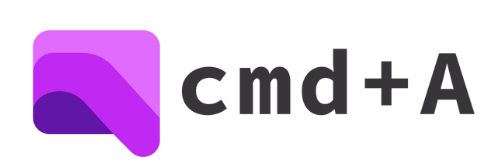
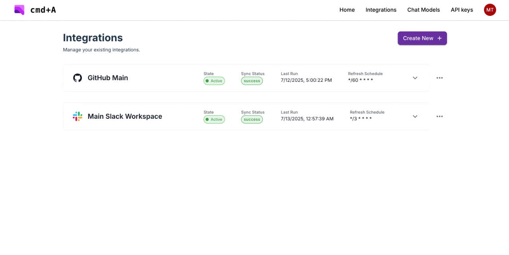
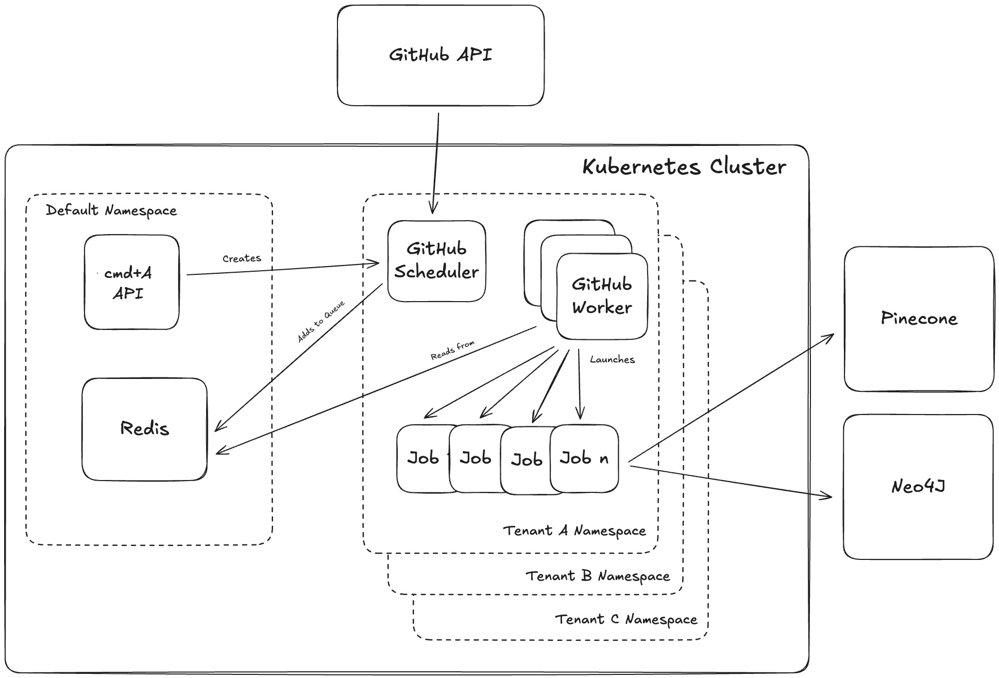
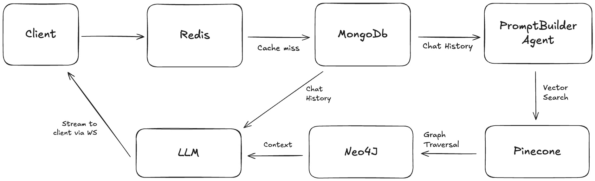

<p align="center">

<p>

# `cmd+A`: Chat with your internal tools

> [!IMPORTANT]
> - This repo and the corresponding demo website https://cmda.mihir-trivedi.com are **NOT intended for production use.**
> - This project is primarily for learning purposes. I fully acknowledge that Kubernetes is overkill for such a simple app!
> - I am very open to feedback! Please open an PR or create an issue if there's something you see that can be improved.

## Introduction
cmd+A enables users "chat" with their internal stores of knowledge via GraphRAG. Users simplify specify their source connections, and cmd+A automatically:
- Sets up workers to periodically parse content from the source (including OCR for file attachments)
- Sets up a knowledge graph to store similar documents together (e.g., `file X -- lives in --> Slack message Y`, `Slack message Y -- reply to --> Slack message Z`, and so forth).
- Performs entity resolution to link different integrations together (e.g., `Slack message Z -- mentions --> Github PR A`).

Additional cmd+A features include:
- Semantic search + graph traversal in response to a user's query.
- Multiple chat model providers (OpenAI, Anthropic, Gemini, Groq, Mistral)
- Source attribution

The following integrations are supported:
- Slack
- Github

## Demo


## Tech Stack

- Development: minikube, skaffold
- Backend: FastAPI (HTTP + Websockets), SQLModel, Alembic, PydanticAI, MongoDb, Redis, Pinecone, Neo4J
- Frontend: Vite, React + Typescript, nginx
- Deployment: Docker, DigitalOcean Kubernetes, Github Actions

## Local development

cmd+A was developed using minikube and skaffold. The following make targets can be used to setup your local development environment:
```
make setup-dev-env
make setup-skaffold-cluster
skaffold dev
```

Skaffold automatically handles port-forwarding for resources exposed within the minikube cluster:
- API: `http://localhost:8000`
- Frontend: `http://localhost:5173`
- Mongo Express: `http://localhost:8081` (username `admin`, password `pass`)
- Neo4J Database: `http://localhost:7474` (usename `neo4j`, password `password`)

## Architecture

cmd+A is deployed on a Kubernetes cluster. Tenant resources are separated via namespaces.

### Integrations

The following diagram shows how cmd+A processes information from integrations (using GitHub as an example.)



- Each source is associated with two resources: a scheduler (CRON job) and some workers (deployment).
- Data for each source is logically separated into "parent groups" (e.g., Slack _channels_, Github _repositories_, Notion _pages_, and so on).
- The scheduler periodically identifies parent groups from the source (via source-specific APIs) and adds the parent group to a Redis queue.
- The workers continuously read from this queue. For each parent group, it identifies any new data since the last run, separates new data into chunks (e.g., only process 100 slack messages at a time), and launch processing jobs to embed / upsert the chunks and update the graph.
- Embeddings are stored in Pinecone, and graph relationships are stored in Neo4J.
- Processing jobs are also responsible for performing entity resolution.

### Hybrid Search

The following diagram shows how cmd+A streams chats to the UI. Chat information is communicated via a Websocket.



- When the user asks a new query, grab the chat history from Redis. If there is a cache miss, grab the chat history from MongoDb.
- Pass this chat history to a PromptBuilder agent. This generates a more complete and thorough user prompt.
- Then, perform hybrid search:
  - Embed the detailed query and search across Pinecone for semantically similar discussions.
  - Given the retrieved messages, traverse the graph to:
      - Find related threads and replies.
      - Identify who was involved (helpful for escalating recurring issues).
      - Retrieve attachments/code snippets shared in those discussions.
      - Connect with external integrations if linked.
- Pass the chat history and context to the LLM, along with the detailed user query. This response is streamed, and individual tokens are transmitted to the UI via the Websocket.
- Once the response has finished generating, citations are transmitted to the UI via the Websocket.
- Messages (both the user's initial query and the assistant's response) are stored in Redis for quick, immediate retrieval and MongoDb for longer-term storage. Chats in Redis expire 1 day after the _latest_ message in that chat.

## Improvements
- Tests, tests, tests! Also, graceful error handling throughout.
- Ordered citations (right now, citations may not be referenced sequentially)
- Add "Thinking..." loading state after user sends a query
- Remove duplicate context
- Add feedback mechanisms in the PromptBuilder and GraphRAG agents
- Provide tools to agents for additional context retrieval and processing
